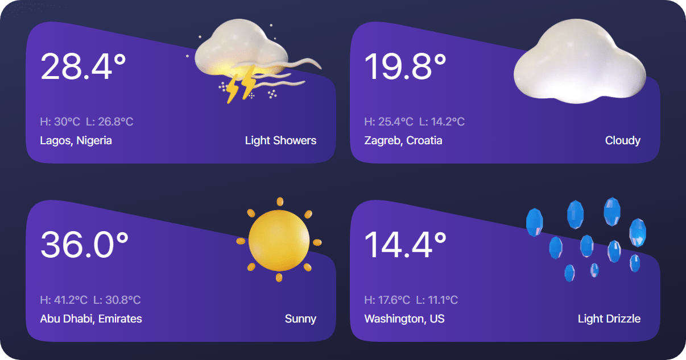

<p align="center">
	
	<p align="center">A dynamic and stunning weather card application 😍. Built with Next.js 13 and Open Meteo API ⚡.</p>
</p>

<div align="center">


[](https://github.com/omzi/weather-cards/issues)
[](https://opensource.org/licenses/MIT)


</div>

---

## 📜 **About**

**Weather Cards** is a modern weather application designed to offer users a swift, visually captivating snapshot of the weather conditions in seven pre-selected locations. Built using [Next.js 13](https://nextjs.com/), it integrates seamlessly with the [Open Meteo API](https://open-meteo.com/) to retrieve accurate daily weather statistics.

<p align="center">
	
</p>

---

## 🚀 **Features**

- ***Dynamic Data Fetching***: Seamlessly retrieves real-time weather statistics for seven distinct locations.
- ***Detailed Weather Insights***: At a glance, get to know:
	- The current temperature
	- Highest temperature for the day
	- Lowest temperature for the day
	- Weather conditions, described in relatable terms
	- Iconic visuals representing each weather condition
- ***Responsive Design***: The app's layout is both desktop and mobile-friendly, ensuring a consistent user experience across devices.
- ***Enhanced UI Experience***: With aesthetic graphics and smooth transitions, the app promises a visually delightful user interaction.
- ***Reliability***: Built upon the dependable Open Meteo API, ensuring accurate and timely weather updates.
<br><br>

## 💻 **Technologies Used**

- ***Web Framework:*** [Next.js 13](https://nextjs.com/)
- ***Weather API:*** [Open Meteo API](https://open-meteo.com/)
- ***Programming Language:*** [TypeScript](https://typescriptlang.org/)
- ***Hosting:*** [Vercel](https://vercel.com/)
<br><br>

## 🚩 **Prerequisites**
You should have the following installed on your system:
* [Node.js](https://nodejs.org/) version => v18.16.1
* [NPM](https://npmjs.org) version >= 9.5.1
* [VS Code](https://code.visualstudio.com) *(or any other code editor or IDE of your choice)*
<br><br>

## ⚡ **Getting Started**
Before you proceed, please ensure your system satisfies the prerequisites above. <br><br>
First things first, clone the repo into your desired folder & cd into it:
```shell
$ git clone https://github.com/omzi/weather-cards.git && cd weather-cards
```
Install the project's dependencies:
```shell
npm install
```
Start the development server:
```shell
npm run dev
```
Open [http://localhost:3000](http://localhost:3000) with your browser to see the result.

You can start editing the page by modifying `app/page.tsx`. The page auto-updates as you edit the file.
<br><br>

## 📄 **License**

This project is licensed under the MIT License. See the [`LICENSE`](./LICENSE) file for more details.
